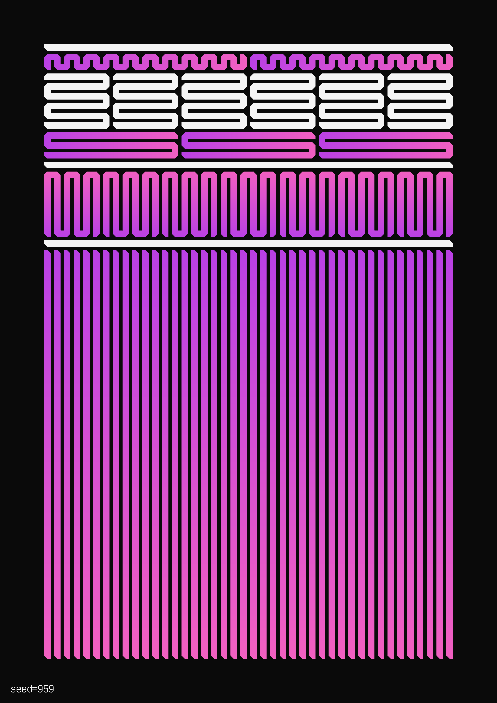
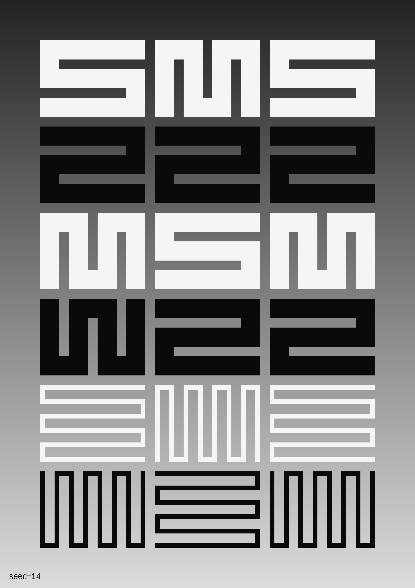
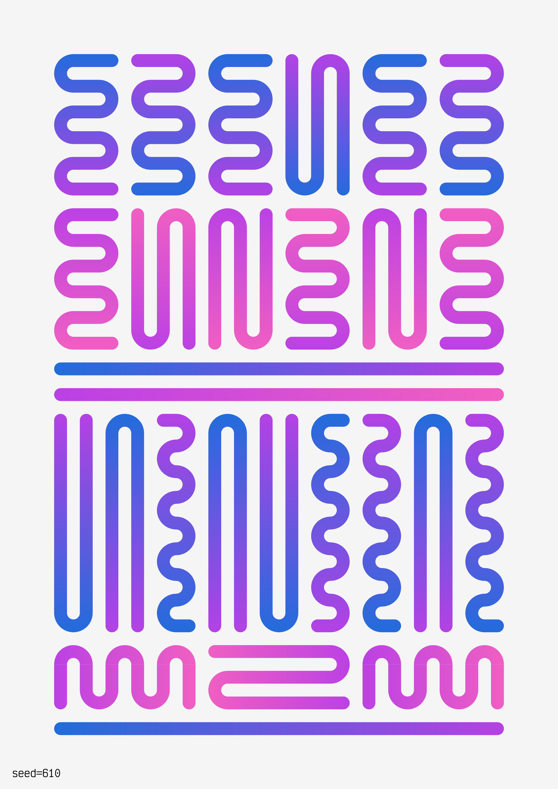
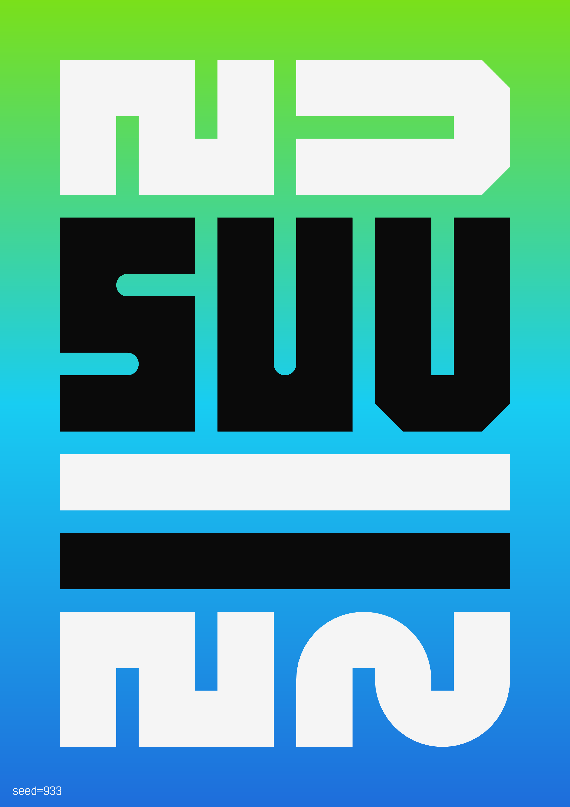
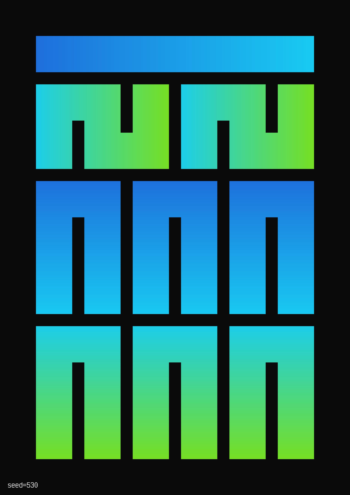
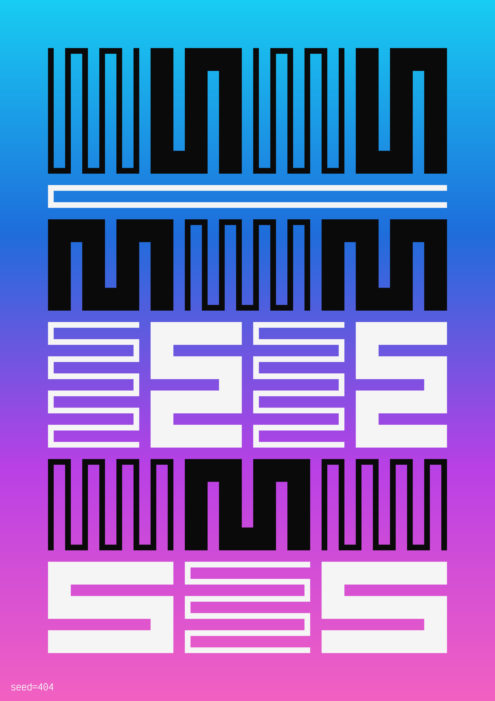
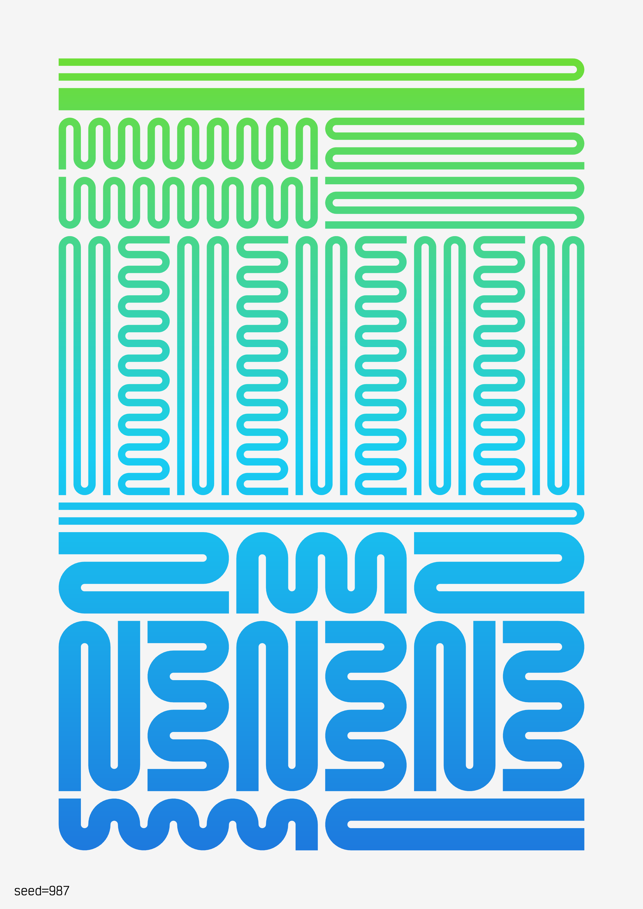
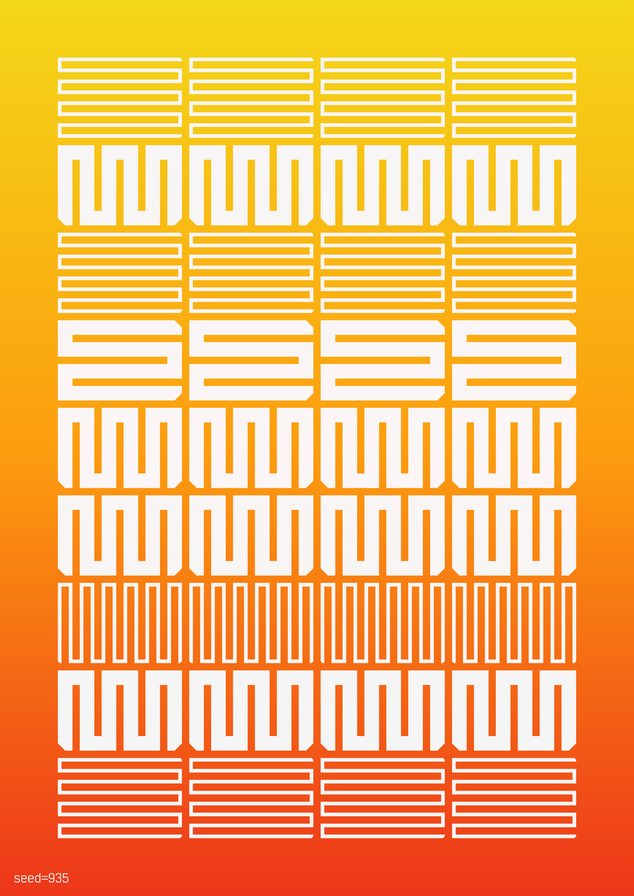

# Hommage à Molnár

"Hommage à Molnár" is a generative art project combining the pioneering spirit of [Vera Molnár](https://dam.org/museum/artists_ui/artists/molnar-vera) with timeless graphic design aesthetics.

## Live view

Go to https://ronikaufman.github.io/hommage-a-molnar to see a random output. The [seed](https://en.wikipedia.org/wiki/Random_seed) can be specified by writing it an URL parameter (for example: https://ronikaufman.github.io/hommage-a-molnar/?seed=42). Tested on desktop browsers, not mobile.

## Print series

A series of 25 [prints](./prints) was produced, on A4 Hahnemühle German Etching paper. The seeds were selected by the artist.

01-05

06-10

11-15

16-20

21-25

## License

This work is licensed under a
[Creative Commons Attribution-NonCommercial-ShareAlike 4.0 International License][cc-by-nc-sa].

[![CC BY-NC-SA 4.0][cc-by-nc-sa-image]][cc-by-nc-sa]

[cc-by-nc-sa]: http://creativecommons.org/licenses/by-nc-sa/4.0/
[cc-by-nc-sa-image]: https://licensebuttons.net/l/by-nc-sa/4.0/88x31.png
