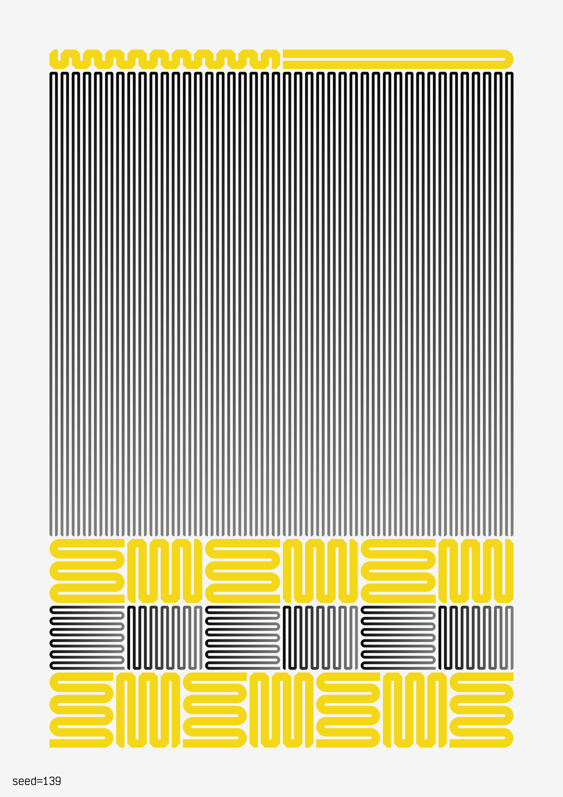
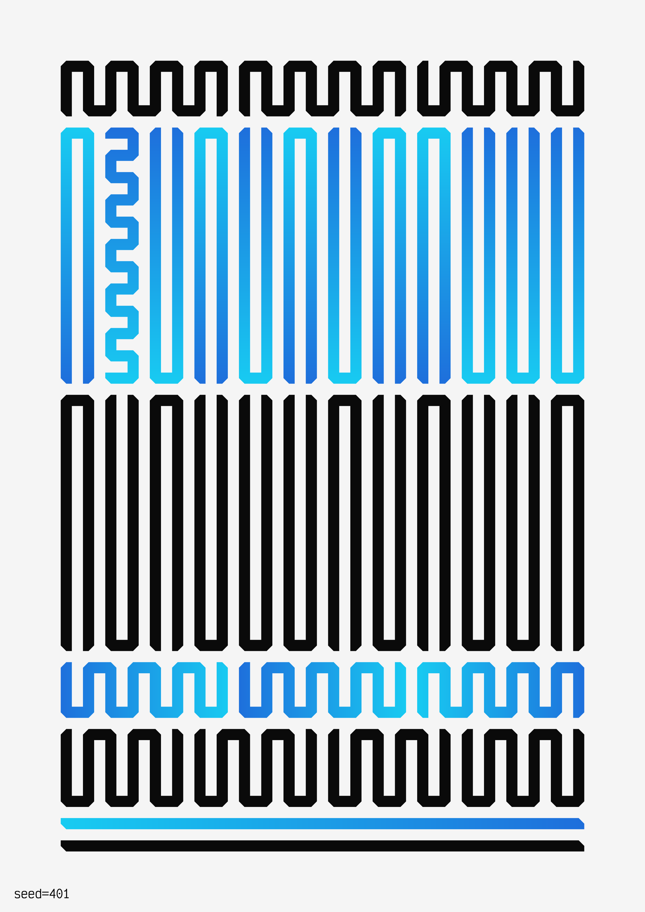
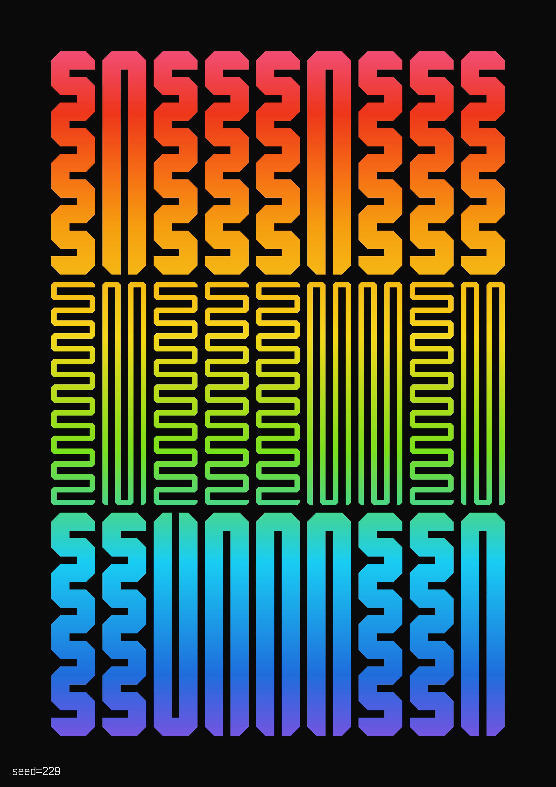

# Hommage à Molnár

"Hommage à Molnár" is a generative art project evoking the pioneering spirit of Vera Molnár.

Go to https://ronikaufman.github.io/hommage-a-molnar to see a random output. You can add specify the seed by writing it an URL parameter (for example: https://ronikaufman.github.io/hommage-a-molnar/?seed=42).

## Print series

A series of 25 [prints](./prints) was produced, using the edition numbers as the seeds.

1-5

6-10

11-15

16-20

21-25

## License

This work is licensed under a
[Creative Commons Attribution-NonCommercial-ShareAlike 4.0 International License][cc-by-nc-sa].

[![CC BY-NC-SA 4.0][cc-by-nc-sa-image]][cc-by-nc-sa]

[cc-by-nc-sa]: http://creativecommons.org/licenses/by-nc-sa/4.0/
[cc-by-nc-sa-image]: https://licensebuttons.net/l/by-nc-sa/4.0/88x31.png
